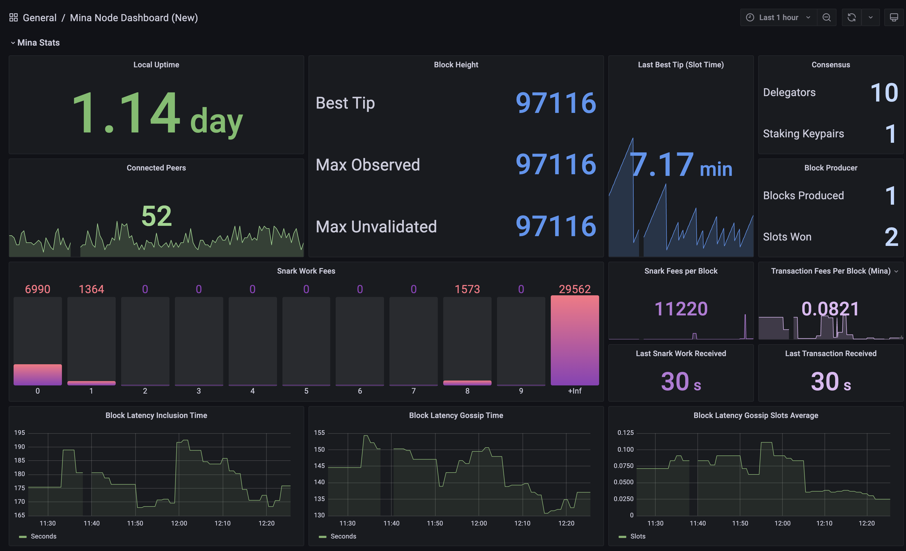
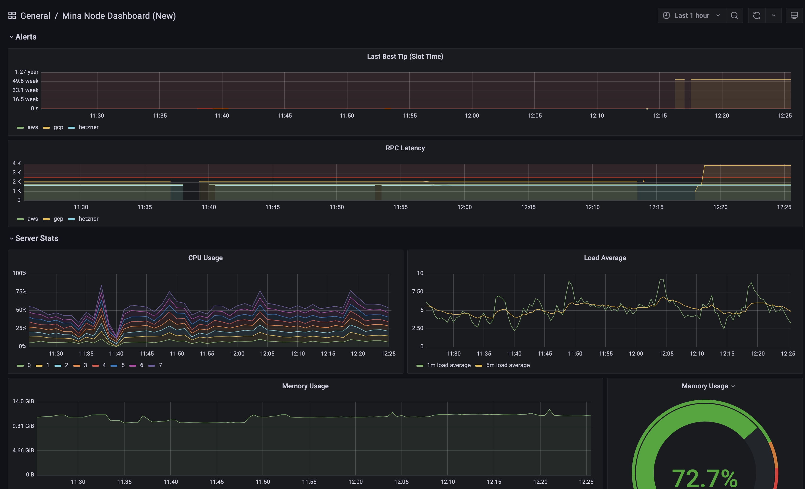

# Mina Node Dashboard (Using Prometheus & Grafana)

This is a guide on how to set up a Mina Node Dashboard using Prometheus and Grafana using Ubuntu 18.04 running on a t3.micro AWS EC2 instance.





## Step 1: Set up the new server

First up you need to set up a new server to run your Mina node dashboard. You can set this up to run on your Mina Block Producer server but it is **NOT** recommended.

### Create new AWS EC2 instance 

Start by creating a new AWS EC2 instance (https://aws.amazon.com/ec2/):

 - **Amazon Machine Image (AMI):** Ubuntu Server 18.04 LTS (HVM), SSD Volume Type
 - **Instance Type:** t3.micro

In this example we will use a t3.micro instance type but it likely work well on a server with less specifications.

### Configure Security Groups

Add the following Custom TCP rules to allow inbound traffic to Grafana and Prometheus:

 - **Grafana**
    - Type: Custom TCP Rule
    - Port Range: 3000
    - Description: Grafana
  - **Prometheus**
    - Type: Custom TCP Rule
    - Port Range: 9090
    - Description: Prometheus


## Step 2: Installing Prometheus on the new server

Next up you need to install Prometheus on your new server. Prometheus will collect all the real time metrics from your Mina node and store them in a time series database.

Connect to your new AWS instance and follow the following guide to install Prometheus:

https://computingforgeeks.com/install-prometheus-server-on-debian-ubuntu-linux/)

If everything worked correctly you should now be able to see Prometheus running by going to http://[IP Address]:9090

(replace [IP Address] with the public IP address of your prometheus server)


## Step 3: Enabling metrics on the Mina server

Now you need to set up the Mina server so that Prometheus can access the metrics. 

Important note: If you want to capture metrics from multiple Mina servers then you will need to repeat this step on each Mina node.

### Enable Mina metrics port

The Mina daemon needs some extra flags to allow the metrics to be accessed. If you're using the '~/.mina-env' file for this you can do the following.

Open the mina-env file for editing:

```shell
nano ~/.mina-env
```

Add the metric-ports flag to the 'EXTRA_FLAGS`

```shell
--metrics-port 6060
```

### Open ports on Mina server

Next you need to open some ports on your Mina node to allow Prometheus to communicate.

Create the following firewall rule on your Mina server and allow the inbound traffic from Prometheus:

 - **Prometheus**
    - Type: Custom TCP Rule
    - Port Range: 6060, 9100
    - Source: [IP Address]
    - Description: Prometheus

*replace [IP Address] with the public IP address of your prometheus server*

## Step 4: Install node_exporter on the Mina node

As well as the Mina specific metrics we also want to capture the server metrics so we can see how the server is performing (eg. RAM usage, CPU, etc.). To enable this you need to install the node_exporter.

Important note: If you want to capture metrics from multiple Mina servers then you will need to repeat this step on each Mina node.

### Create Prometheus system user / group
We’ll create a dedicated Prometheus system user and group. The  -r or –system option is used for this purpose.

```shell
sudo groupadd --system prometheus
sudo useradd -s /sbin/nologin --system -g prometheus prometheus
```
### Install node_exporter

Download node_exporter archive.

```shell
curl -s https://api.github.com/repos/prometheus/node_exporter/releases/latest \
| grep browser_download_url \
| grep linux-amd64 \
| cut -d '"' -f 4 \
| wget -qi -
```

Extract downloaded file and move the binary file to /usr/local/bin.

```shell
tar -xvf node_exporter*.tar.gz
cd  node_exporter*/
sudo cp node_exporter /usr/local/bin
```

Confirm installation.

```shell
node_exporter --version
```
node_exporter, version 0.18.1 (branch: HEAD, revision: 3db77732e925c08f675d7404a8c46466b2ece83e)
  build user:       root@b50852a1acba
  build date:       20190604-16:41:18
  go version:       go1.12.5

Create node_exporter service.

```
sudo tee /etc/systemd/system/node_exporter.service <<EOF
[Unit]
Description=Node Exporter
Wants=network-online.target
After=network-online.target

[Service]
User=prometheus
ExecStart=/usr/local/bin/node_exporter

[Install]
WantedBy=default.target
EOF
Reload systemd and start the service.

sudo systemctl daemon-reload
sudo systemctl start node_exporter
sudo systemctl enable node_exporter
Confirm status:

$  systemctl status node_exporter.service 
● node_exporter.service - Node Exporter
   Loaded: loaded (/etc/systemd/system/node_exporter.service; enabled; vendor preset: enabled)
   Active: active (running) since Wed 2019-08-21 23:41:11 CEST; 8s ago
 Main PID: 22879 (node_exporter)
    Tasks: 6 (limit: 4585)
   Memory: 6.6M
   CGroup: /system.slice/node_exporter.service
           └─22879 /usr/local/bin/node_exporter
.................................................
```

## Step 5: Configure Prometheus to get Mina metrics

Ok now you have Prometheus and the node exporter installed you need to set it up to get the metrics from the Mina node.

### Configure Prometheus to retrieve metrics from the Mina server

Now you need to configure Prometheus to retrieve outher Mina metrics.

On the prometheus server open the config file:

```shell
sudo nano /etc/prometheus/prometheus.yml
```

Update 'job_name' to `mina` and replace 'targets' with the IP address of your mina server:

```yml
# my global config
global:
  scrape_interval:     15s # Set the scrape interval to every 15 seconds. Default is every 1 minute.
  evaluation_interval: 15s # Evaluate rules every 15 seconds. The default is every 1 minute.
  # scrape_timeout is set to the global default (10s).

# Alertmanager configuration
alerting:
  alertmanagers:
  - static_configs:
    - targets:
      # - alertmanager:9093

# Load rules once and periodically evaluate them according to the global 'evaluation_interval'.
rule_files:
  # - "first_rules.yml"
  # - "second_rules.yml"

# A scrape configuration containing exactly one endpoint to scrape:
# Here it's Prometheus itself.
scrape_configs:
  # The job name is added as a label `job=<job_name>` to any timeseries scraped from this config.
  - job_name: 'mina'

    # metrics_path defaults to '/metrics'
    # scheme defaults to 'http'.

    static_configs:
    - targets: ['[IP_ADDRESS]:6060','[IP_ADDRESS]:9100']
      labels:
        instance: '[NODE_NAME]'

```

If you want to capture metrics from multiple Mina nodes then you can add additional targets like below:
```yml
    static_configs:
    - targets: ['[IP_ADDRESS]:6060','[IP_ADDRESS]:9100']
      labels:
        instance: '[NODE_NAME_1]'
    - targets: ['[IP_ADDRESS]:6060','[IP_ADDRESS]:9100']
      labels:
        instance: '[NODE_NAME_2]'
    - targets: ['[IP_ADDRESS]:6060','[IP_ADDRESS]:9100']
      labels:
        instance: '[NODE_NAME_3]'                
```

*replace [IP_ADDRESS] with the public IP address of your Mina server & replace [NODE_NAME] with a name to describe the server

Now restart Prometheus:
```shell
sudo systemctl restart prometheus
```

If Prometheus is now working as expected we should be able to view the metrics collected from our Mina server.

Open the Prometheus web client again:
http://[IP_ADDRESS]:9090/

*replace IP_ADDRESS with the IP address of your Prometheus server*

Enter a valid mina metrics such as `Coda_Transition_frontier_max_blocklength_observed` and press execute.

If it's working as expected you should see the data for the metric selected similar to below:


## Step 6: Installing Grafana

Ok now we have all the metrics we want to visualise all them on a fancy dashboard! Grafana is just what we need for this.

Use the following guide to install Grafana on the same server as Prometheus:

https://computingforgeeks.com/how-to-install-grafana-on-ubuntu-debian/

If everything worked correctly you should now be able to see Grafana running by going to http://[IP Address]:3000

(replace [IP Address] with the public IP address of your prometheus server)


## Step 7: Connect Grafana to Prometheus Data Source

Now to connect Grafana to our data.

Click on the 'Configuration' menu option on the left hand side and then 'Data Sources' and 'Add Data Source'.


In the configuration settings for the data source set the following and then click the 'Save and Test' button.
 - Name: Prometheus Mina
 - URL: http://localhost:9090


## Step 8: Importing the Mina Node Dashboard

To import the Mina Node Dashboard click on the 'Create' menu on the left and select 'Import'.


In the 'Import via panel json' section paste the following JSON [Mina Node Dashboard JSON](./prometheus-mina-dashboard.json). Also available to download here - https://grafana.com/grafana/dashboards/14299

You should now see your new Mina Node Dashboard!


There's also an excellent community-built 'Mina Performance Dashboard' available to import here - https://grafana.com/grafana/dashboards/12840
